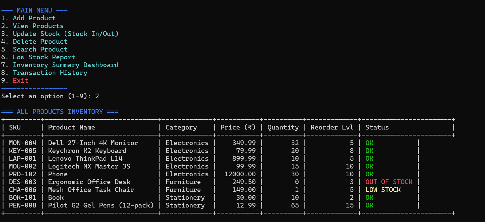
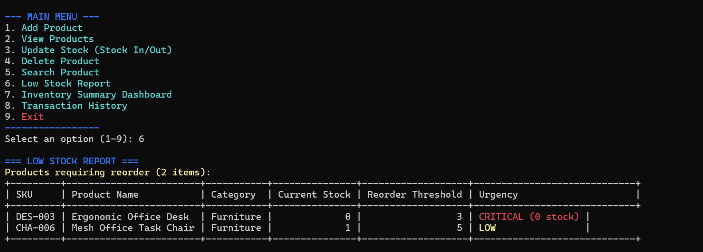
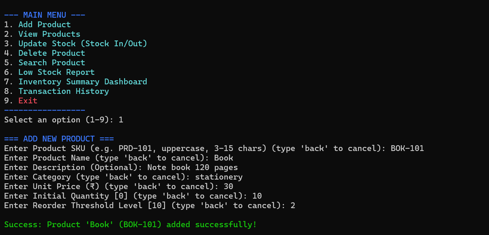
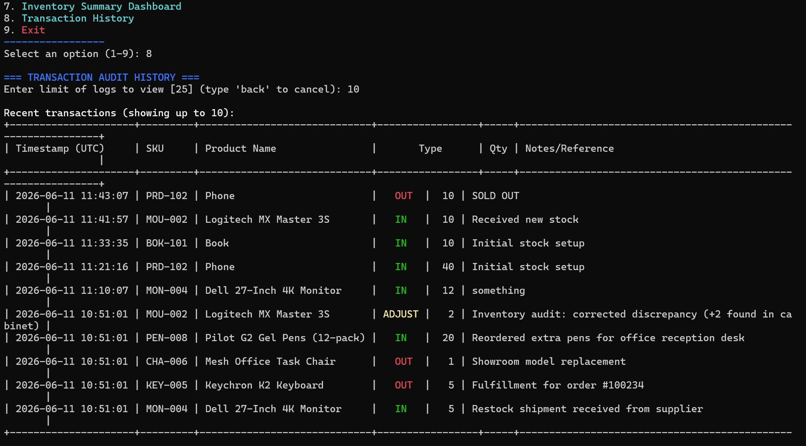

# Inventory Management System (IMS)

A modular, terminal-based Inventory Management System* built with Python and SQLite. This project is structured as a college internship mini-project, showcasing clean coding practices, modular architecture, database design, robust input validation, transaction handling, centralized logging, and unit testing.

---

## 🌟 Key Features

1. **Product Management (CRUD)**: Add, view, search, and delete products with automatic data validation.
2. **Stock Transaction Tracking**: Process stock updates (`IN` for restocking, `OUT` for sales/dispatch, and `ADJUST` for audits) with transactional logging.
3. **Database Constraints & Schema Safety**: Automatically enforces unique SKUs, non-negative values for quantities/prices, and cascades deletions of products to their transaction histories.
4. **Summary Dashboard**: Displays overall metrics (total products, stock level, inventory valuation, low stock alerts, transaction count) and category-level breakdowns.
5. **Low Stock Alerts**: Identifies items at or below their custom reorder threshold and highlights critical levels.
6. **Transaction Audit Trail**: View historical movements of items with timestamps, transaction types, quantities, and reference notes.
7. **Clean CLI Experience**: Leverages ANSI escape codes for professional color-coded indicators, layouts, and custom-formatted ASCII tables (built without third-party dependencies).
8. **Logging System**: A dual-handler logging mechanism logging structured events to `inventory.log`.
9. **Unit Testing**:  Comprehensive unit testing for core functionality for database interactions, validation rules, stock changes, and reporting functions.

---


## Technologies Used

- Python 3.8+
- SQLite3
- unit test
- logging
- ANSI Terminal Formatting


## 📂 Project Architecture

```
Inventory_management/
│
├── main.py                  # CLI Menu interface & operation handler
├── seed_db.py               # Pre-populates the database with demo products & transactions
├── requirements.txt         # Project requirements (Zero external dependencies)
├── inventory.db             # SQLite Database (generated on startup)
├── inventory.log            # System application logs (generated on startup)
│
├── inventory_manager/       # Core package
│   ├── __init__.py          # Declares package
│   ├── database.py          # DB connection manager & schema initialization
│   ├── core.py              # Product CRUD operations and stock transaction tracking
│   ├── reports.py           # Dashboard statistics & transaction history reports
│   ├── logger.py            # Centralized logging configuration
│   └── utils.py             # Validation helpers, ASCII table formatter, ANSI colors
│
└── tests/                   # Automated unit testing suite
    ├── __init__.py
    └── test_core.py         # Test cases for database, CRUD, and reports
```

---

## 📊 Database Schema Design

The system runs on SQLite, implementing relational tables, check constraints, foreign keys, and triggers.

```mermaid
erDiagram
    products {
        INTEGER id PK "AUTOINCREMENT"
        TEXT sku UK "NOT NULL"
        TEXT name "NOT NULL"
        TEXT description
        TEXT category "NOT NULL"
        REAL price "NOT NULL CHECK(price >= 0)"
        INTEGER quantity "NOT NULL DEFAULT 0 CHECK(quantity >= 0)"
        INTEGER reorder_level "NOT NULL DEFAULT 10 CHECK(reorder_level >= 0)"
        TEXT created_at "DEFAULT CURRENT_TIMESTAMP"
        TEXT updated_at "DEFAULT CURRENT_TIMESTAMP"
    }
    transactions {
        INTEGER id PK "AUTOINCREMENT"
        INTEGER product_id FK "NOT NULL"
        TEXT transaction_type "CHECK(IN, OUT, ADJUST)"
        INTEGER quantity "NOT NULL CHECK(quantity >= 0)"
        TEXT notes
        TEXT timestamp "DEFAULT CURRENT_TIMESTAMP"
    }
    products ||--o{ transactions : "FK (ON DELETE CASCADE)"
```



- **Cascade Deletion**: If a product is deleted, its associated transaction logs are automatically cleaned up.
- **Auto-Update Trigger**: The `update_product_timestamp` trigger automatically updates the `updated_at` column in the `products` table on any row modification.

---

## 🚀 Getting Started

### Prerequisites
- **Python 3.8+**
- SQLite (pre-installed with Python standard library)

### 1. Installation
Clone or copy the project files to a directory on your machine.

### 2. (Optional) Seed the Database
To view the application with realistic, pre-populated data (highly recommended for evaluation):
```bash
python seed_db.py
```
This script will initialize the schema in `inventory.db` and insert sample items along with sample stock movement audits.

### 3. Run the Application
Start the main terminal-based interface:
```bash
python main.py
```

---

## 🧪 Running Unit Tests

A comprehensive suite of automated tests verifies CRUD behavior, database integrity, stock limits, and calculations. To run the test suite:

```bash
python -m unittest discover -s tests
```

---

## 📝 Logging Configuration

The system records debug and operational events in `inventory.log` in the root folder.
Each log entry contains:
- Timestamp (ISO 8601 format)
- Log Level (`INFO`, `WARNING`, `ERROR`, `CRITICAL`)
- Filename and line number where the event occurred
- Log Message and stack traces (for errors)

*Example log:*
```text
2026-06-11 16:51:00,102 - INFO - [database.py:47] - Initializing database at inventory.db
2026-06-11 16:51:00,115 - INFO - [core.py:38] - Product SKU LAP-001 added successfully.
2026-06-11 16:51:00,128 - WARNING - [core.py:75] - Stock update failed for SKU MOU-002: Insufficient stock. Current: 3, Requested change: -8
```

---

## 📸 Screenshots

### Main Inventory View



---

### Low Stock Report



---

### Inventory Dashboard



---

### Transaction History




## 📜 Evaluation Checklist (for Internships)

- [x] **Modular Structure**: Logic cleanly split into CLI interface, database connectivity, reports, CRUD core, and validation helpers.
- [x] **Relational Schema**: Enforced database schema constraints (`CHECK`, `UNIQUE`, `FOREIGN KEY` with `CASCADE` delete).
- [x] **Validation & Safety**: Inputs like SKU regex patterns, float prices, integer quantities, and empty values are validated *before* hitting the database.
- [x] **Logging**: Full audit trail of database operations and errors written to `inventory.log`.
- [x] **Clean CLI Layout**: Professional ANSI color highlights, custom text wrappers, table structures, and warning alerts.
- [x] **Unit Testing**: Tests verify business logic using a temporary database, isolated and repeatable.

